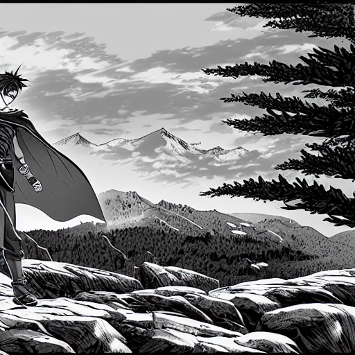
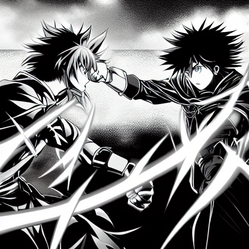

# MangaGen: AI-Powered Manga Generation Framework


<p align="center">
  
</p>

MangaGen is a comprehensive framework that combines state-of-the-art AI models to generate manga-style comics from text prompts. It leverages the power of Groq LLM for intelligent prompt engineering and TrinArt Stable Diffusion for high-quality manga image generation.

## ✨ Features

- 🎨 **Multiple Manga Styles**: Support for various manga aesthetics (shonen, seinen, shoujo, action, noir)
- 📝 **LLM-Enhanced Prompting**: Automatically converts story ideas into panel-specific descriptions
- 🖼️ **Advanced Image Processing**: Custom manga-specific enhancements, tone patterns, and effects
- 📚 **Layout Engine**: Flexible panel arrangements in vertical, horizontal, or grid layouts
- 🔧 **Full Customization**: Extensive parameters for controlling every aspect of the generation process
- 🔄 **Context Awareness**: Maintains visual and narrative coherence between panels
- 🌐 **CLI & API Support**: Command-line interface and programmatic API

## 📋 Table of Contents

- [Installation](#-installation)
- [Quick Start](#-quick-start)
- [Usage Examples](#-usage-examples)
- [Command Line Options](#-command-line-options)
- [Pipeline Overview](#-pipeline-overview)
- [Components](#-components)
- [API Reference](#-api-reference)
- [Examples Gallery](#-examples-gallery)
- [Contributing](#-contributing)
- [License](#-license)
- [Acknowledgements](#-acknowledgements)

## 🔧 Installation

### Prerequisites

- Python 3.8 or higher
- CUDA-capable GPU recommended for faster generation
- Groq API key (free tier available)

### Standard Installation

1. Clone the repository:
   ```bash
   git clone https://github.com/YOUR_USERNAME/MangaGen.git
   cd MangaGen
   ```

2. Install dependencies:
   ```bash
   pip install -r requirements.txt
   ```

3. Configure your Groq API key in a `.env` file:
   ```
   GROQ_API_KEY=your_groq_api_key_here
   ```

   You can get a free API key from [Groq Console](https://console.groq.com/).

### Docker Installation

```bash
docker build -t mangagen .
docker run -it --gpus all -v $(pwd)/output:/app/output mangagen
```

## 🚀 Quick Start

Generate a complete manga story in one command:

```bash
python generate_manga_story.py --prompt "A samurai's final battle against a legendary demon" --panels 4
```

For a simple single-panel manga image:

```bash
python simple_manga_generator.py --prompt "A cyberpunk detective in a rainy neon city"
```

For enhanced manga with effects:

```bash
python enhanced_manga_generator.py --prompt "An epic space battle" --style highcontrast --effect action --speed_lines
```

## 🎮 Usage Examples

### Story-Driven Multi-Panel Manga

```bash
python generate_manga_story.py \
  --prompt "Two rival martial artists discover they must work together to defeat an ancient evil" \
  --panels 6 \
  --style "action" \
  --layout "vertical" \
  --manga_style "highcontrast" \
  --effects "action" \
  --enhance \
  --borders \
  --seed 42
```

### Emotional Character-Focused Scene

```bash
python generate_manga_story.py \
  --prompt "A heartfelt reunion between childhood friends who were separated for years" \
  --panels 4 \
  --style "shoujo" \
  --manga_style "screentone" \
  --effects "emotional" \
  --tones \
  --enhance
```

### Atmospheric Horror Sequence

```bash
python generate_manga_story.py \
  --prompt "A detective investigates an abandoned mansion with a dark history" \
  --panels 5 \
  --style "seinen" \
  --layout "grid" \
  --manga_style "sketch" \
  --effects "background" \
  --tones \
  --borders
```

## 📊 Command Line Options

### Story Parameters
- `--prompt`: Main story description (required)
- `--panels`: Number of panels to generate (default: 4)
- `--style`: Manga style - manga, shonen, seinen, shoujo, action, noir (default: manga)
- `--layout`: Panel layout - vertical, horizontal, grid (default: vertical)

### Generation Parameters
- `--steps`: Number of denoising steps (default: 30)
- `--guidance_scale`: Guidance scale (default: 7.5)
- `--seed`: Random seed for reproducibility (default: None)
- `--width`: Image width in pixels (default: 512)
- `--height`: Image height in pixels (default: 512)

### Context Parameters
- `--context_strength`: Strength of influence from previous panels (default: 0.3)
- `--use_text_context`: Include previous panel descriptions in prompts (flag)

### Model Parameters
- `--llm_model`: Groq LLM model to use (default: llama3-70b-8192)
- `--diffusion_model`: TrinArt model version (default: diffusers-115k)

### Post-processing Parameters
- `--manga_style`: Visual style - highcontrast, sketch, screentone, action (default: highcontrast)
- `--enhance`: Enhance image quality (flag)
- `--effects`: Apply special effects - action, emotional, impact, background (default: None)
- `--tones`: Add manga tones (flag)
- `--borders`: Add borders to panels (flag)

### Output Parameters
- `--output_dir`: Output directory (default: output)
- `--save_individual`: Save individual panels (flag)

## 🔄 Pipeline Overview

MangaGen follows a multi-stage pipeline to generate manga:

1. **Prompt Engineering**: Converts high-level story concepts into detailed panel descriptions using Groq LLM
2. **Image Generation**: Generates base images using TrinArt Stable Diffusion
3. **Style Application**: Applies manga-specific artistic styles and enhancements
4. **Effect Processing**: Adds visual effects like speed lines, impacts, or emotional elements
5. **Layout Arrangement**: Combines individual panels into a complete manga page

## 📦 Components

MangaGen consists of several modular components:

- **manga_prompt_generator.py**: Generates detailed panel prompts from story descriptions
- **simple_manga_generator.py**: Basic manga generation with TrinArt model
- **enhanced_manga_generator.py**: Advanced manga generation with additional effects
- **generate_manga_story.py**: Complete pipeline for multi-panel manga stories
- **utils/image_utils.py**: Utilities for manga-specific image processing

## 📖 API Reference

### MangaPromptGenerator

```python
from manga_prompt_generator import MangaPromptGenerator

# Initialize with your Groq API key
generator = MangaPromptGenerator(api_key="your_groq_api_key")

# Generate panel prompts
panel_prompts = generator.generate_panel_prompts(
    story_prompt="A space explorer discovers an ancient alien artifact",
    num_panels=4,
    style="manga",
    model="llama3-70b-8192"
)

# Save prompts to file
generator.save_prompts_to_file(panel_prompts, "my_panel_prompts.json")
```

### StandaloneMangaGenerator

```python
from enhanced_manga_generator import generate_manga

# Generate a manga image with effects
image = generate_manga(
    prompt="Samurai duel at sunset",
    style="highcontrast",
    effect="action",
    speed_lines=True,
    border=True
)

# Save the image
image.save("samurai_duel.png")
```

## 🖼️ Examples Gallery

<p align="center">
  
  
</p>

<p align="center">
  <em>Left: "A warrior faces a demon" | Right: "Rivals meet for a final duel"</em>
</p>

## 🤝 Contributing

Contributions are welcome! Please feel free to submit a Pull Request.

1. Fork the repository
2. Create your feature branch (`git checkout -b feature/amazing-feature`)
3. Commit your changes (`git commit -m 'Add some amazing feature'`)
4. Push to the branch (`git push origin feature/amazing-feature`)
5. Open a Pull Request

## 📄 License

This project is licensed under the MIT License - see the [LICENSE](LICENSE) file for details.

## 🙏 Acknowledgements

- [Groq](https://console.groq.com/) for the powerful and free LLM API
- [TrinArt](https://huggingface.co/naclbit/trinart_stable_diffusion_v2) for the manga-optimized diffusion model
- [Diffusers](https://github.com/huggingface/diffusers) for the Stable Diffusion pipeline
- [LangChain](https://langchain.com/) for LLM integration tools